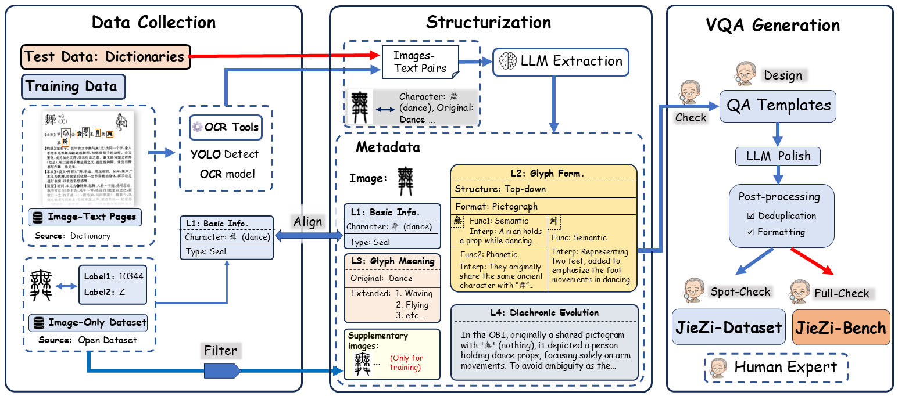

# JieZi: A Large-Scale Expert-Audited Dataset and Benchmark for Ancient Chinese Character Exegesis

  

## 🚨 Reviewer Quick Access: Supplementary Material

> **For ACM MM reviewers:** please check the supplementary file first.

  

| Item | Access |
| --- | --- |
| 📄 Supplementary Material (PDF) | [**Click to Open**](docs/supplementary_material.pdf?raw=1) |
| 📌 Repo Path | `docs/supplementary_material.pdf` |

---

  

## Important Note

The original data of the dataset is sourced from public channels such as the dictionary, and its copyright shall remain with the original providers.
The collated and annotated dataset presented in this case is for **non-commercial** use only and is currently licensed to universities and research institutions.

## Download

- This repo currently hosts supplementary material and part of data.
- Full dataset/code/model release links will be added after publication.

| Platform | Link |
| --- | --- |
| 🤗 Hugging Face | [🔗 JieZi](https://huggingface.co/datasets/Ran0/JieZi) |
| 🌟 ModelScope | [🔗 JieZi](https://www.modelscope.cn/datasets/Ran0501/JieZi) |

## Planned Open-Source Release

We plan to release:

- VQA-style QA pairs for ancient Chinese character exegesis.
- Evaluation codes and metrics.

## License

The repository currently uses the license in [LICENSE](LICENSE).
Dataset/model licenses will be announced with the official release.

## Citation

Citation information will be added after publication.
